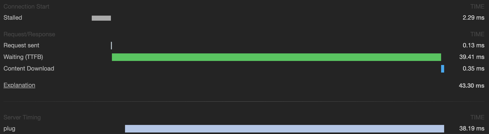

# Plug.Telemetry.ServerTiming

This library provides support for [`Server-Timing`][st] header in Plug
applications by exposing [Telemetry][tm] events as metrics in HTTP headers. This
allows developers to use their's browser DevTools to display server metrics in
readable way.

## Installation

The package can be installed by adding `plug_server_timing` to your list of
dependencies in `mix.exs`:

```elixir
def deps do
  [
    {:plug_telemetry_server_timing, "~> 0.1.0"}
  ]
end
```

Then add `Plug.ServerTiming` to your pipeline **BEFORE** any `Plug.Telemetry`
definitions:

```elixir
plug Plug.Telemetry.ServerTiming
plug Plug.Telemetry, event_prefix: [:my, :plug]
```

And then you need to install metrics you will want to see in the DevTools:

```elixir
Plug.Telemetry.ServerTiming.install([
  {[:my, :plug, :stop], :duration}
])
```

Now when you will open given page in [browsers with support for
`Server-Timing`][caniuse] you will be able to see the data in DevTools, example
in Google Chrome:



## WARNING

Current specification of `Server-Timing` do not provide a way to specify event
start time, which mean, that the data displayed in the DevTools isn't trace
report (like the content of the "regular" HTTP timings) but raw dump of the data
displayed as a bars. This can be a little bit confusing, but right now there is
nothing I can do about it.

## License

MIT License

[caniuse]: https://caniuse.com/#feat=server-timing
[st]: https://w3c.github.io/server-timing/#the-server-timing-header-field
[tm]: https://github.com/beam-telemetry/telemetry
